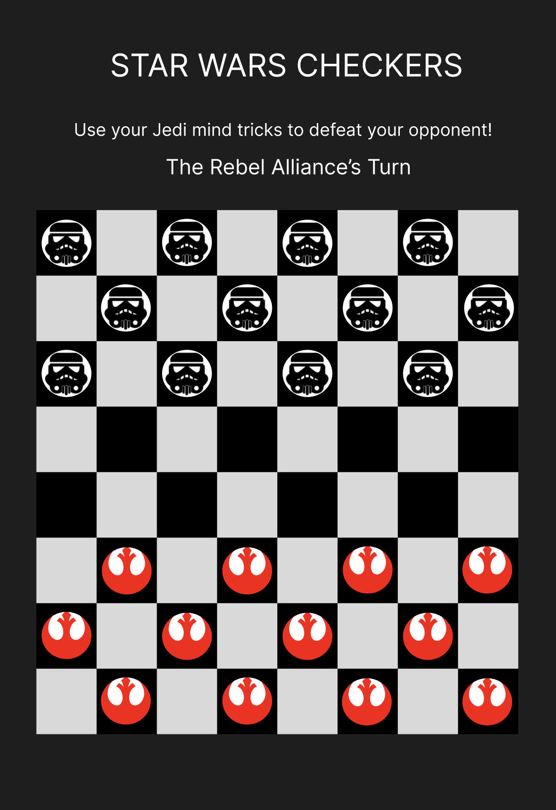

## Star Wars Checkers
- Variations of the game of checkers have been played and loved by ancient and modern people alike! Now this game of strategy is making its debut in a galaxy far far away! In this Star Wars themed checkers game, play as a either the Rebel Alliance or the Galactic Empire! May the force be with you.

## Technologies Used
- HTML
- CSS
- Javascript 

## Getting Started
- Link to Game:

- Instructions: 
    - This is a two player, turn-based game. One player plays as the Galactic Empire and one player plays as the Rebel Alliance.
    - The Rebel Alliance has the first move.
    - You may move any of your 12 tokens to any open dark diagnal space. 
    - You may only move forward at the start of the game. 
    - If one of your tokens reaches the opposite side that token becomes either Master Yoda or Darth Vader and can now move both forward and backwards.
    - You can collect your opponent's tokens if your checker is diagnol to them by jumping over their tokens to the open diagnal dark space on the opposite side of your opponent.
    - You win the game if you have collected all your opponent's tokens or if you have blocked all their tokens so that they cannot move. 
    - If all your tokens are blocked and you cannot move, click the forfeit button as you lost the game. 

## Next Steps
- I want to add a play the computer option.
- I want to keep track of total wins and losses.
- I want to have Star Wars themed music play when the browser opens until the game begins.

## The app's functionality

Minimum Viable Product

As a user:
- I want to be able to have 2 players, because that is how checkers is played.
- I want the two players to each have their own designated tokens that only they can move.
- I want to be able to take turns.
- I want to be able to move the tokens to the diagnal dark spaces next to the token I select to move.
- I want to be able to jump over my opponent's token if there is an empty diagnal space on the opposite side. 
- I want any tokens I jump over to dissapear.
- I want to lose if I do not have any visible tokens left on the board.
- I want my token to become a king if it reaches the other side of the board.
- I want to win if I have at least one token on the board while my opponent has none or if my opponent cannot move. 
- I want to be able to play again if the game is over (if there is a winner).

If I have some time I would like to add:
- I want to add play the computer functionality option.
- I want to keep track of total wins and losses.
- I want to have Star Wars themed music play when the browser opens until the game begins.


## Design of the App
- I want the design to be clean.
- I want my checkers game to be star wars themed and I want the design on the tokens to be storm troopers and the rebel alliance symbol.
- Font- Star Wars Font Family

```html 
<link href="https://fonts.cdnfonts.com/css/star-wars" rel="stylesheet">
```

```css
font-family: 'Star Wars', sans-serif;
```


## Wireframe


## Pseudocode
- Constants
    - PLAYER_LOOKUP
- State variables
    - game board - 1 array of 8 arrays
    - turn - -1 || 1
    - winner - null || 1 || -1

- Cache DOM elements
    - message place
    - play again button
    - forfeit button
    - tokens

- Upon loading the app should
    - Initialize all state variables
        - create the array of 8 nested arrays
        - turn var should be set to 1 (player 1)
        - winner var should be null
    - Render changes to the DOM
        - render the board 
        - render the tokens on their proper side
        - render the message
        - do not render the play again button
    - Wait for interaction

- Handle a player clicking a token and a space to move to
    - update the board with the player move (player can only move forwards unless that token has reached the other side and becomes a king)
    - update the turn var
    - check for a winner
    - check if the token is now a king (has reached the opposite side)
    - re-render the board with the player's move

- Handle a player clicking the replay button
    - reset the state var
    - re-render the board

- Handle a player clicking the forfeit button
    - set the player who did not click the button to the winner
    - reset the state var
    - re-render the board

- Check for a winner
    - check if a player does not have any visible tokens (the loser) and set the other player as the winner

- Check if a token is a king
    - check if a player has reached the last array opposite them
    - change the design on the token if it has reached the other side
    - allow the token to be moved forwards and backwards if it has reached the other side
