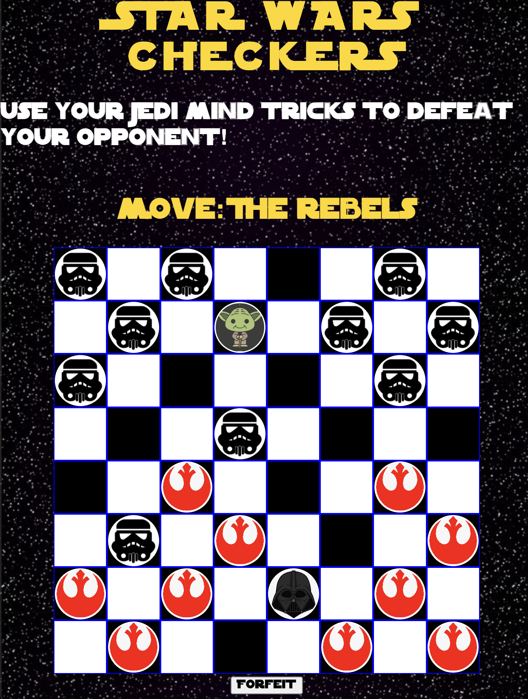

## Star Wars Checkers
- Variations of the game of checkers have been played and loved by ancient and modern people alike! Now this game of strategy is making its debut in a galaxy far far away! In this Star Wars themed checkers game, play as either the Rebel Alliance or the Galactic Empire! May the force be with you.

## Images of Game

## Technologies Used
- HTML
- CSS
- Javascript 

## Getting Started
- Link to Game:
[Star Wars Checkers](https://jgallagher13.github.io/checkers/) 
- Instructions: 
    - This is a two player, turn-based game. One player plays as the Galactic Empire and one player plays as the Rebel Alliance.
    - The Rebel Alliance has the first move.
    - You may move any of your 12 tokens to any open dark diagnal space. 
    - You may only move forward at the start of the game. 
    - If one of your tokens reaches the opposite side that token becomes either Master Yoda or Darth Vader and can now move both forward and backwards.
    - You can collect your opponent's tokens if your checker is diagnol to them by jumping over their tokens to the open diagnal dark space on the opposite side of your opponent.
    - You win the game if you have collected all your opponent's tokens or if you have blocked all their tokens so that they cannot move. 
    - If all your tokens are blocked and you cannot move, click the forfeit button as you lost the game. 

## Next Steps
- I want to add a play the computer option.
- I want to have a play again button.
- I want to keep track of total wins and losses.
- I want to have Star Wars themed music play when the browser opens until the game begins.

